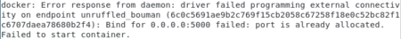

# NLTK Container

## Functions

- Tokenization - Done
- Part-of-Speech (POS) Tagging - Done
- Named Entity Recognition (NER) - Done
- Lemmatization - Done
- Stemming - Done
- Sentiment Analysis - Done
- Text Classification - Skipped (No Labelled Data)
- Keyword Extraction - Done
- Sentence Segmentation - Done
- Language Detection - Done
- Word Frequency Distribution - Done
- Synonyms and Antonyms - Done
- N-Grams - Done
- Stopword Removal - Done
- Text Similarity

## How to use

cd into this directory and run the following command:

```bash
./test.sh
```

It will setup the docker container, and iterate through the subroutines to demonstrate the functionalities.

## Updating subroutines

For customizing the inputs, you would need to upload your files of interest, and updates the subroutines to target them.

## Port Issues



If you run into this issue it can be resolved by changing the port number in test.sh file.

## Acknowledgement
- [nltk](https://github.com/nltk/nltk): (the Natural Language Toolkit) Open source Python modules, data sets, and tutorials supporting research and development in Natural Language Processing (License Apache)

## Citations
If you use this in your research, please cite this repo:
```bibtex
@misc{fhsbap2024vfetnltkcontainer,
  title={Voice-Feature-Extraction-Toolkit/nltk_container},
  author={Khemakhem, Mahdi},
  journal={GitHub repository},
  year={2024},
  publisher={GitHub},
  howpublished = {\url{https://github.com/FHS-BAP/Voice-Feature-Extraction-Toolkit/tree/main/nltk_container}}
}
```
and this paper:
```bibtex
@book{bird2009natural,
  title={Natural Language Processing with Python},
  author={Bird, Steven and Loper, Edward and Klein, Ewan},
  year={2009},
  publisher={O'Reilly Media Inc.}
}
```